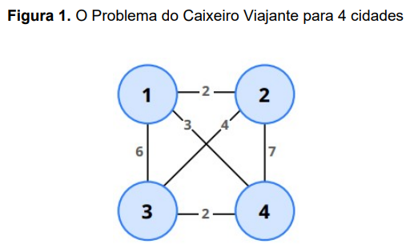
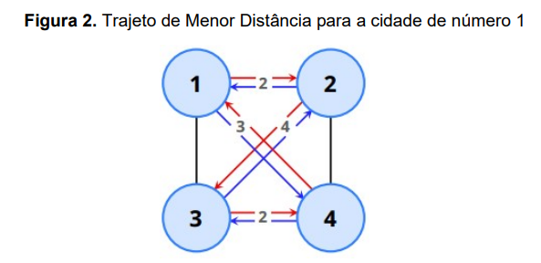

# Descrição do Problema

O Problema do Caixeiro Viajante (PCV) é um dos problemas clássicos na área de Computação e pode ser descrito da seguinte maneira. Suponha que você seja um representante comercial e precisa visitar n cidades diferentes para vender seu produto. Nesta viagem, cada cidade deve ser visitada uma única vez e, ao final do trajeto, você deve retornar à cidade de origem. Existem diferentes possibilidades de realizar este trajeto, mas o interesse está no trajeto de menor custo.

A definição de custo está diretamente relacionada ao propósito da aplicação. Em alguns casos, por exemplo, deseja-se identificar o trajeto com a menor quantidade possível de pedágios. Em outros, a quantidade é indiferente e não interfere na escolha, contanto que as rodovias sejam de melhor qualidade. Neste trabalho, o critério de custo que deverá ser considerado é o de menor distância. Além disso, por simplicidade, considere que entre quaisquer duas cidades A e B existe um, e somente um, caminho direto (que também representa um caminho direto de B para A com o mesmo custo). 

A Figura 1 ilustra o Problema do Caixeiro Viajante para 4 cidades, que foram esquematizadas em círculos. As conexões entre as duas cidades indicam a existência de um caminho direto, e em cada ligação existe um valor que representa a distância entre tais cidades. Dentre os possíveis trajetos que saem da cidade número 1, o de menor custo (custo 11) está destacado em vermelho na Figura 2 (1 − 2 − 3 − 4 − 1). Vale ressaltar que o caminho inverso (1 − 4 − 3 − 2 − 1), destacado em azul, é equivalente, e consequentemente, possui o mesmo custo. 

Além do cenário aqui apresentado, diversos outros problemas reais possuem características e desafios similares ao PCV, tais como: roteamento de telecomunicações, definição de rotas de ônibus escolares e de entrega de refeições, problemas de logística em geral, entre outros. 

## Objetivo do Projeto

O trabalho tem como principal objetivo desenvolver uma solução para o PCV, ou seja, dada uma cidade de origem, encontrar o trajeto de menor custo que passe por todas as cidades e por cada uma delas apenas uma vez, retornando à cidade de origem.

O desenvolvimento da solução envolve as seguintes atividades principais: 
1. Modelar uma solução para o PCV utilizando as Estruturas de Dados estudadas (até o momento da entrega) em aula.

2. Desenvolver um algoritmo que encontre o trajeto de menor custo usando uma abordagem de "força bruta” com solução exata. Nesta abordagem, deve-se avaliar todos os trajetos possíveis para encontrar o de menor custo → problema de análise combinatória.

3. Implementar a solução em Linguagem C, usando (obrigatoriamente) o conceito de TAD, modularização de código e Makefile para compilação e geração da aplicação executável.

4. Analisar a complexidade computacional da solução proposta usando notação big O e apresentar um gráfico de crescimento de tempo de execução para diferentes tamanhos de entrada (máximo de n = 12).

Essas atividades compõem as 3 partes do trabalho, descritas abaixo.

## Parte I - Modelagem da SOlução (25% da nota final)

## Parte II - Implementação (55% da nota final)

## Parte III - ANálise de Complexidade e RElatório (20% da nota final)

## Entrega do Trabalho